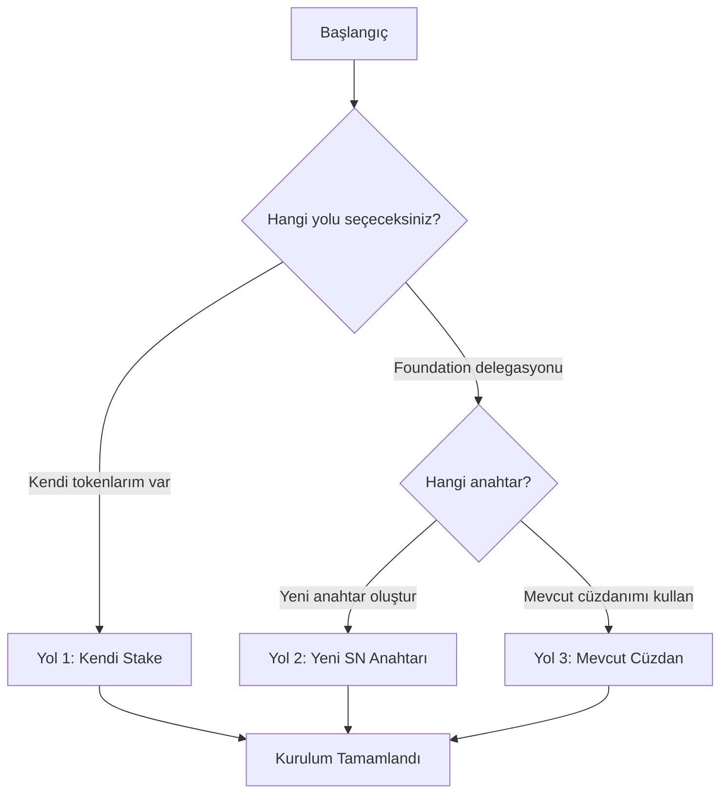

# Lumera SuperNode Ubuntu 22.04 Kurulum Rehberi

> **Güncellenme Tarihi:** Ağustos 2025  
> Bu rehber Ubuntu 22.04 LTS üzerinde Lumera SuperNode kurulumu için hazırlanmıştır.

## 📋 İçindekiler

- [Giriş](#giriş)
- [Sistem Gereksinimleri](#sistem-gereksinimleri)
- [Ön Hazırlık](#ön-hazırlık)
- [Kurulum Yolları](#kurulum-yolları)
- [Yol 1: Kendi Stake'iniz ile Kurulum](#yol-1-kendi-stakeiniz-ile-kurulum)
- [Yol 2: Foundation Delegasyonu (Yeni SuperNode Anahtarı)](#yol-2-foundation-delegasyonu-yeni-supernode-anahtarı)
- [Yol 3: Foundation Delegasyonu (Mevcut Cüzdan Anahtarı)](#yol-3-foundation-delegasyonu-mevcut-cüzdan-anahtarı)
- [Servis Olarak Çalıştırma](#servis-olarak-çalıştırma)
- [Doğrulama ve Test](#doğrulama-ve-test)
- [Sorun Giderme](#sorun-giderme)
- [Güvenlik Önerileri](#güvenlik-önerileri)

---

## 🚀 Giriş

Lumera SuperNode, Lumera blockchain ağında özel roller üstlenen node'lardır. Her SuperNode mutlaka bir **Validator** ile bağlantılı olmalıdır. Bu rehber 3 farklı kurulum yolu sunar:

- **Yol 1:** Kendi tokenlarınızla stake yaparak
- **Yol 2:** Foundation'dan delegasyon alarak (yeni anahtar)
- **Yol 3:** Foundation'dan delegasyon alarak (mevcut cüzdan anahtarı)

---

## 💻 Sistem Gereksinimleri

### Minimum Gereksinimler
| Bileşen | Minimum | Önerilen |
|---------|---------|----------|
| **CPU** | 8 vCPU | 16 vCPU |
| **RAM** | 16 GB | 64 GB |
| **Depolama** | 1 TB NVMe | 4 TB NVMe |
| **Ağ** | 1 Gbps | 5 Gbps |
| **İşletim Sistemi** | Ubuntu 22.04 LTS | Ubuntu 22.04 LTS |

### Ağ Gereksinimleri
Güvenlik duvarında aşağıdaki portları açmanız gerekiyor:
- **4444/tcp** - gRPC API
- **8002/tcp** - REST Gateway  
- **4445/tcp** - P2P İletişim

---

## 🔧 Ön Hazırlık

### 1. Sistem Güncellemesi
```bash
# Sistem paketlerini güncelle
sudo apt update && sudo apt upgrade -y

# Gerekli araçları yükle
sudo apt install -y curl wget jq build-essential git ufw
```

### 2. Validator Kontrolü
⚠️ **ÖNEMLİ:** SuperNode kurulumuna başlamadan önce mutlaka bir Validator'unuzun olması ve `BOND_STATUS_BONDED` durumunda olması gerekiyor.

```bash
# Validator durumunu kontrol et
lumerad query staking validator $(lumerad keys show <cuzdanadı> --bech val -a)
```

### 3. Güvenlik Duvarı Ayarları
```bash
# UFW güvenlik duvarını etkinleştir
sudo ufw enable

# Gerekli portları aç
sudo ufw allow 22/tcp    # SSH
sudo ufw allow 4444/tcp  # gRPC API
sudo ufw allow 8002/tcp  # REST Gateway
sudo ufw allow 4445/tcp  # P2P

# Durumu kontrol et
sudo ufw status
```

### 4. SuperNode Binary Kurulumu
```bash
# SuperNode binary'sini indir
sudo curl -L -o /usr/local/bin/supernode \
  https://github.com/LumeraProtocol/supernode/releases/latest/download/supernode-linux-amd64

# Çalıştırma izni ver
sudo chmod +x /usr/local/bin/supernode

# Sürümü kontrol et
supernode version
```

---

## 🛤️ Kurulum Yolları

Aşağıdaki 3 yoldan durumunuza uygun olanı seçin:



---

## 🎯 Yol 1: Kendi Stake'iniz ile Kurulum

Bu yol kendi LUME tokenlarınızla minimum stake gereksinimini karşılayabilen operatörler içindir.

### 1.1. Token Edinme ve Delegasyon
```bash
# Validator operator adresinizi öğrenin
VALOPER=$(lumerad keys show <cuzdanadı> --bech val -a)
echo "Validator Operator Adresi: $VALOPER"
```
⚠️⚠️⚠️NOT: Validator olusturmus ve min 10k token stake etmiş olmanız gerekmektedir. 
Supernode kurulumundada valıdator olusturdugumuz cuzdanı kullanacagız

### 1.2. SuperNode Başlatma (Yeni Anahtar)
```bash
# SuperNode'u yeni anahtar ile başlat
supernode init --key-name mySNKey --chain-id lumera-testnet-2
```
Not: Bu kodu calıstırdıktan sonra sızden bazı bılgıler ısteyecek;
⚠️⚠️⚠️ONEMLI: Cuzdan ekleme secenegını kullanın ve valıdator olusturdugunuz cuzdanın kelımelerını gırın yenı cuzdan olusturmayın.
1. OS seç
2. 8 hanelı bır sıfre olustur
3. kurulum yaptıgın sunucu ıp sını gır
4. Port cakısmıyorsa onerdıgı portlar ıle devam et. cakısıyorsa bos olan portlardan ayarla


### 1.3. SuperNode Kayıt İşlemi
Validator sunucunuzda aşağıdaki komutu çalıştırın:

```bash
# Validator sunucusunda çalıştırın  
VALOPER=$(lumerad keys show <cuzdanadı> --bech val -a)
SN_ENDPOINT="<supernode_ip>:4444"

# SuperNode sunucusunda adresi öğrenin:
# supernode keys list --home ~/.supernode
# Sonra manuel olarak SN_ACCOUNT değişkenini ayarlayın:
SN_ACCOUNT="<valıdator olusturdugumuz cuzdan adresımız>"

lumerad tx supernode register-supernode \
  $VALOPER $SN_ENDPOINT $SN_ACCOUNT \
  --from <cuzdanadı> \
  --chain-id lumera-testnet-2 \
  --gas auto \
  --gas-adjustment 1.3 \
  --fees 5000ulume
```

---

## 🏢 Yol 2: Foundation Delegasyonu (Yeni SuperNode Anahtarı)

Bu yol Lumera Foundation'dan delegasyon alacak operatörler için yeni bir SuperNode anahtarı oluşturur.

### 2.1. SuperNode Başlatma (Yeni Anahtar)
```bash
# Yeni anahtar ile SuperNode başlat
supernode init --key-name mySNKey --chain-id lumera-testnet-2
```

**Yapılacaklar:**
1. Talimatları takip edin
2. **Mnemonic kelimelerini güvenli şekilde saklayın**
3. **Oluşturulan adresi kopyalayın**

### 2.2. Foundation'a Adres Gönderme
Oluşturulan SuperNode adresini (örn: `lumera1...`) Lumera Foundation'a gönderin. Foundation bu adres için gecikmeli vesting hesabı oluşturacak.

**Foundation'dan onay bekleyin** - hesap oluşturulup fonlanana kadar bekleyin.

### 2.3. Delegasyon İşlemi
```bash
# Validator operator adresinizi öğrenin
VALOPER=$(lumerad keys show <validator_key_name> --bech val -a)
SN_ACCOUNT="<adim_2_1_den_olusan_supernode_adresi>"

# Delegasyon yapın
lumerad tx staking delegate $VALOPER <miktar>ulume \
  --from $SN_ACCOUNT \
  --gas auto \
  --gas-adjustment 1.3 \
  --fees 7000ulume \
  --chain-id lumera-testnet-2 
```

### 2.4. SuperNode Kayıt İşlemi
Vesting hesabı aktif olduktan sonra validator sunucunuzda:

```bash
# Validator sunucusunda çalıştırın
VALOPER=$(lumerad keys show <validator_key_name> --bech val -a)
SN_ENDPOINT="<supernode_ip>:4444"

# SuperNode sunucusunda adresi öğrenin:
# supernode keys list --home ~/.supernode  
# Sonra manuel olarak SN_ACCOUNT değişkenini ayarlayın:
SN_ACCOUNT="<supernode_keys_list_komutundan_alinan_adres>"

lumerad tx supernode register-supernode \
  $VALOPER $SN_ENDPOINT $SN_ACCOUNT \
  --from <validator_key_name> \
  --chain-id lumera-testnet-2 \
  --gas auto \
  --gas-adjustment 1.3 \
  --fees 5000ulume 
```

---

## 💳 Yol 3: Foundation Delegasyonu (Mevcut Cüzdan Anahtarı)

Bu yol mevcut bir cüzdan anahtarını (Keplr, Leap vb.) kullanmak isteyen operatörler içindir.

### 3.1. Yeni Cüzdan Anahtarı Oluşturma
1. Güvenilir bir cüzdan (Keplr, Leap) kullanarak **yeni bir hesap** oluşturun
2. **Bu adresin hiç işlem geçmişi olmamalı** - tamamen yeni, kullanılmamış olmalı
3. **Mnemonic kelimelerini güvenli şekilde saklayın**

### 3.2. Foundation'a Adres Gönderme
Yeni, kullanılmamış cüzdan adresini Lumera Foundation'a gönderin. Foundation bu adres için gecikmeli vesting hesabı oluşturacak.

**Vesting hesabının aktif olduğuna dair onay bekleyin.**

### 3.3. Delegasyon İşlemi
```bash
# Validator operator adresinizi öğrenin
VALOPER=$(lumerad keys show <validator_key_name> --bech val -a)
SN_ACCOUNT="<adim_3_1_den_olusan_cuzdan_adresi>"

# Delegasyon yapın
lumerad tx staking delegate $VALOPER <miktar>ulume \
  --from $SN_ACCOUNT \
  --gas auto \
  --gas-adjustment 1.3 \
  --fees 7000ulume \
  --chain-id lumera-testnet-2 
```

### 3.4. SuperNode Başlatma (Anahtar Geri Yükleme)
```bash
# Mevcut anahtarı geri yükleyerek SuperNode başlat
supernode init --key-name myWalletSNKey --recover --chain-id lumera-testnet-2
```

Bu komut sizden Adım 3.1'de oluşturduğunuz cüzdanın mnemonic kelimelerini girmenizi isteyecek.

### 3.5. SuperNode Kayıt İşlemi
Validator sunucunuzda kayıt komutunu çalıştırın:

```bash
# SuperNode sunucusunda adresi öğrenin:
# supernode keys list --home ~/.supernode
# Sonra manuel olarak SN_ACCOUNT değişkenini ayarlayın:
SN_ACCOUNT="<supernode_keys_list_komutundan_alinan_adres>"

# Validator sunucusunda çalıştırın
VALOPER=$(lumerad keys show <validator_key_name> --bech val -a)
SN_ENDPOINT="<supernode_ip>:4444"

lumerad tx supernode register-supernode \
  $VALOPER $SN_ENDPOINT $SN_ACCOUNT \
  --from <validator_key_name> \
  --chain-id lumera-testnet-2 \
  --gas auto \
  --gas-adjustment 1.3 \
  --fees 5000ulume \
  --node https://rpc.lumera.io:443
```

---

## 🔐 Keyring Şifre Ayarları

SuperNode 3 farklı şifre yönetimi destekler:

### 1. Config Dosyasında Düz Metin
```yaml
# ~/.supernode/config.yml
keyring:
  backend: os
  passphrase_plain: "12341234"
```

### 2. Dosya Yolu
```yaml
# ~/.supernode/config.yml
keyring:
  backend: file
  dir: keys
  passphrase_file: /home/kullanici/.supernode-password
```

Dosyayı oluşturun:
```bash
echo "12341234" > ~/.supernode-password
chmod 600 ~/.supernode-password
```

### 3. Ortam Değişkeni
```yaml
# ~/.supernode/config.yml
keyring:
  backend: file
  dir: keys
  passphrase_env: SUPERNODE_PWD
```

Ortam değişkenini ayarlayın:
```bash
export SUPERNODE_PWD="12341234"
# .bashrc veya .profile dosyasına ekleyin
echo 'export SUPERNODE_PWD="12341234"' >> ~/.bashrc
```

---


## ✅ Doğrulama ve Test

### 1. SuperNode Kayıt Durumu Kontrolü
```bash
# Validator operator adresinizi öğrenin
VALOPER=$(lumerad keys show <validator_key_name> --bech val -a)

# SuperNode durumunu kontrol edin
lumerad query supernode get-super-node $VALOPER --node https://rpc.lumera.io:443
```

**Beklenen Durum:** `ACTIVE`  
**Sorunlu Durum:** `INSUFFICIENT_STAKE` (delegasyonları kontrol edin)

### 2. Ağ Bağlantısı Kontrolü
```bash
# gRPC API kontrolü
curl -s http://<supernode_ip>:4444/health

# REST Gateway kontrolü  
curl -s http://<supernode_ip>:8002/health
```

### 3. SuperNode Logları Kontrolü
```bash
# Son 50 log satırını görüntüle
journalctl -u supernode -n 50

# Hata loglarını filtrele
journalctl -u supernode | grep -i error

# Belirli bir zaman aralığındaki loglar
journalctl -u supernode --since "2025-08-05 10:00:00"
```

### 4. Performans Kontrolü
```bash
# Sistem kaynak kullanımı
htop

# Disk kullanımı
df -h

# SuperNode process kontrolü
ps aux | grep supernode

# Port dinleme kontrolü
netstat -tlnp | grep -E "(4444|8002|4445)"
```

---

## 🔧 Sorun Giderme

### Yaygın Sorunlar ve Çözümleri

| Sorun | Olası Nedeni | Çözüm |
|-------|--------------|-------|
| `ELIGIBILITY_FAILED` | Birleşik stake < minimum | Doğru adresler için delegasyonları doğrulayın |
| SuperNode `DISABLED` durumunda | Validator aktif set'ten çıktı | Stake ekleyin veya validator'un tekrar aktif olmasını bekleyin |
| gRPC hataları | Yanlış `lumera.grpc_addr` | Config'de güvenilir public node kullanın |
| Port bağlantı sorunu | Güvenlik duvarı | UFW kurallarını kontrol edin |
| Servis başlamıyor | Keyring şifre sorunu | Şifre ayarlarını kontrol edin |

### Debug Komutları
```bash
# SuperNode config dosyasını kontrol et
cat ~/.supernode/config.yml

# Anahtar listesini görüntüle
supernode keys list --home ~/.supernode

# Manual olarak başlatma (debug için)
supernode start --home ~/.supernode --log-level debug

# Ağ bağlantısı test
ping <rpc_node_ip>
telnet <supernode_ip> 4444
```

### Log Analizi
```bash
# Kritik hataları bul
journalctl -u supernode | grep -i "fatal\|panic\|error"

# Bağlantı sorunlarını bul
journalctl -u supernode | grep -i "connection\|network\|timeout"

# Bellek kullanımı kontrolü
journalctl -u supernode | grep -i "memory\|oom"
```

---

## 🔒 Güvenlik Önerileri

### 1. Temel Güvenlik
- **Ayrı Sunucular:** Validator ve SuperNode'u asla aynı makinede çalıştırmayın
- **Güvenlik Duvarı:** Sadece gerekli portları açın
- **SSH:** Anahtar tabanlı kimlik doğrulama kullanın, şifre ile girişi devre dışı bırakın

### 2. Anahtar Yönetimi
- **OS Keyring:** Üretim ortamında `os` keyring backend'ini kullanın
- **Yedekler:** Validator'un `priv_validator_key.json` dosyasını ve tüm mnemonic kelimelerini güvenli, çevrimdışı yedekleyin
- **İzin Kontrolü:** Anahtar dosyalarının izinlerini 600 (sadece owner okuyabilir) yapın

### 3. Sistem Güvenliği
```bash
# SSH güvenlik ayarları
sudo nano /etc/ssh/sshd_config
# PasswordAuthentication no
# PermitRootLogin no
# Port 2222 (varsayılan port değiştir)

sudo systemctl restart sshd

# Fail2ban kurulum
sudo apt install fail2ban -y
sudo systemctl enable --now fail2ban

# Otomatik güncellemeler
sudo apt install unattended-upgrades -y
sudo dpkg-reconfigure unattended-upgrades
```

### 4. Monitoring ve Alerting
```bash
# Disk kullanımı monitoring
echo "df -h | grep -E '^/dev/(xvda|sda|nvme)'" >> ~/monitor.sh

# SuperNode health check
echo "curl -s http://localhost:4444/health || echo 'SuperNode DOWN'" >> ~/monitor.sh

chmod +x ~/monitor.sh
```

### 5. Yedekleme Stratejisi
```bash
#!/bin/bash
# Yedekleme scripti
BACKUP_DIR="/home/$(whoami)/backups/$(date +%Y%m%d)"
mkdir -p $BACKUP_DIR

# SuperNode config yedekle
cp ~/.supernode/config.yml $BACKUP_DIR/

# Keyring yedekle (dikkatli olun!)
# cp -r ~/.supernode/keys $BACKUP_DIR/

echo "Yedekleme tamamlandı: $BACKUP_DIR"
```

---

## 📚 Faydalı Komutlar

### SuperNode Yönetimi
```bash
# Sürüm kontrolü
supernode version

# Config dosyası kontrolü
supernode config show

# Anahtar listesi
supernode keys list

# Yeni anahtar oluştur
supernode keys add <key_name>

# Anahtar sil
supernode keys delete <key_name>

# Adres göster
supernode keys show <key_name> -a
```

### Lumera Chain Komutları
```bash
# Node durumu
lumerad status

# Validator listesi
lumerad query staking validators

# Delegasyon kontrolü
lumerad query staking delegations-to <validator_operator_addr>

# Bakiye kontrolü
lumerad query bank balances <address>
```

### Sistem Monitoring
```bash
# CPU ve RAM kullanımı
top -p $(pgrep supernode)

# Disk I/O
iotop -p $(pgrep supernode)

# Network bağlantıları
ss -tulpn | grep supernode
```

---

## 📞 Destek ve Topluluk

- **Resmi Dokümantasyon:** [Lumera Docs](https://docs.lumera.io)
- **GitHub:** [LumeraProtocol](https://github.com/LumeraProtocol)
- **Discord:** Lumera Protocol Discord Server
- **Telegram:** @Edsny

---

## 📄 Lisans

Bu rehber MIT lisansı altında sunulmaktadır.

---

## 🙏 Katkıda Bulunma

Bu rehberi geliştirmek için:

1. Bu repo'yu fork edin
2. Değişikliklerinizi yapın
3. Pull request gönderin

---

**⚠️ Sorumluluk Reddi:** Bu rehber eğitim amaçlıdır. Üretim ortamında kullanmadan önce test edin ve kendi riskinizde kullanın.
